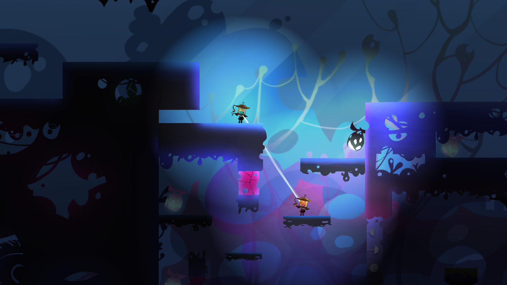

# Together

a two-player platform game

Developed by Unity,C# with 2D Lighting

## Feature

In-game, the player's visibility is limited to the nearby environment, but the visible range will increase as players get closer.

Player can also turn on the light, try to make use of the environment.

## How to play

Player1：

←→:  Move;     
C:  Jump;    
X:  Shoot;    
↑↓:  rotate the light(in stage 2)

Player2：

W,D:  Move;   
J:  Jump;    
K:  Shoot;   
A,S:  rotate the light(in stage 2)

## Notice

Game will get crash unexpectedly when finish stage 1.

Then, please reopen it and press Key M to go to next stage directly.

